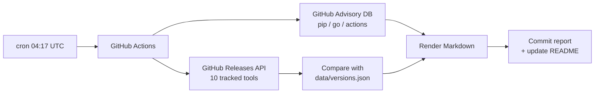

# devops-daily-digest

[](https://github.com/ZarthVazer/devops-daily-digest/actions/workflows/daily-digest.yml)
[](https://github.com/ZarthVazer/devops-daily-digest/actions/workflows/test.yml)

A scheduled GitHub Actions job that every morning collects **new releases of core DevOps tools** and **fresh high/critical security advisories**, writes a Markdown report and commits it to this repository.

I use it to keep track of version upgrades for my own projects (Terraform, Kubernetes, Helm, Argo CD and others) without checking a dozen release pages by hand.

## Latest report

<!-- LATEST:START -->
**2026-10-04** — no new releases. [Full report](reports/2026/10/2026-10-04.md)
<!-- LATEST:END -->

All reports: [`reports/`](reports/)

## How it works



1. The workflow runs on a cron schedule (and can be started manually with *Run workflow*).
2. `digest/main.py` queries the GitHub REST API using the job's built-in `GITHUB_TOKEN`, so no secrets need to be configured.
3. Current versions are compared with the previous run stored in `data/versions.json` to highlight what changed.
4. The report is saved to `reports/YYYY/MM/YYYY-MM-DD.md`, the summary above is updated, and the job commits only if something actually changed.

## Project layout

```
digest/
├── config.py       # tracked tools and advisory filters
├── github_api.py   # tiny REST client, standard library only
├── report.py       # diff + Markdown rendering
└── main.py         # entry point
tests/              # pytest unit tests
data/versions.json  # state between runs
reports/            # generated reports
```

## Run locally

```bash
export GITHUB_TOKEN=...    # optional, raises the API rate limit
python -m digest.main
pytest -q
```

## Design notes

- **No dependencies.** The script uses only the Python standard library, so the job starts fast and there is nothing to keep patched.
- **Fault tolerant.** If one API call fails, that tool is shown as `n/a` instead of failing the whole run.
- **Idempotent.** Running twice a day overwrites the same report; the commit step is skipped when there is no diff.
- **Least privilege.** The workflow only has `contents: write` and uses the short-lived job token.

## Ideas

- Send the summary to Telegram or Slack
- Check the base images used in my other repositories with Trivy
- Open an issue automatically when a tracked tool releases a new major version
